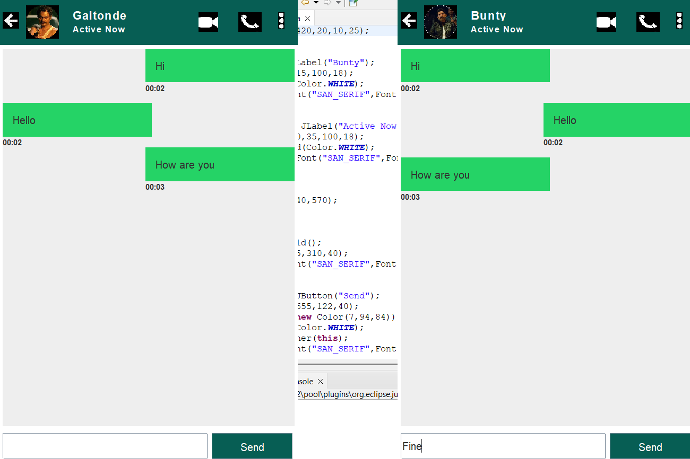

### Chatting Application

A simple Java-based client-server chat application built using Swing for the GUI and sockets for real-time network communication. This project demonstrates the fundamentals of socket programming combined with a modern chat interface inspired by popular messaging apps.

### Features

Real-time two-way text messaging between client and server

User-friendly GUI built with Java Swing

Timestamped chat messages for better readability

Responsive message layout with scrollable chat window

Custom icons and styled chat bubbles

Clean exit functionality by clicking back icon

### Technologies Used

Java SE 8+

Java Swing for graphical user interface

TCP sockets for network communication

Basic multithreading for handling client-server interaction

### Prerequisites

Java Development Kit (JDK) version 8 or above

IDE such as IntelliJ IDEA, Eclipse, or the ability to compile and run Java via command line

### Screenshots



### Usage

Start the server first to listen for incoming client connections.

Launch the client and begin sending messages.

Messages sent by either side appear on their respective chat windows with timestamps.

Click the back arrow icon in the top-left corner to exit the application.

### Project Structure
```
Chatting-Application/
├── client/
│   └── Client.java
├── server/
│   └── Server.java
└── resources/
    └── [Image files for UI components]
```
Client.java: Contains the client-side application code.

Server.java: Contains the server-side application code.

resources/: Holds image files used in the UI.

### Installation
1. Clone the Repository

git clone https://github.com/yourusername/Chatting-Application.git
cd Chatting-Application:contentReference[oaicite:38]{index=38}
2. Compile the Java Files

javac client/Client.java server/Server.java
javac -d . client/Client.java server/Server.java
:contentReference[oaicite:43]{index=43}

3. Run the Server


java server.Server


4. Run the Client

```bash
java client.Client


---

### Future Enhancements

Support for multiple clients concurrently using threading

Persistent chat history saving and loading

File transfer capabilities (images, documents)

End-to-end encryption for secure messaging

Improved UI/UX with animations and themes

 
